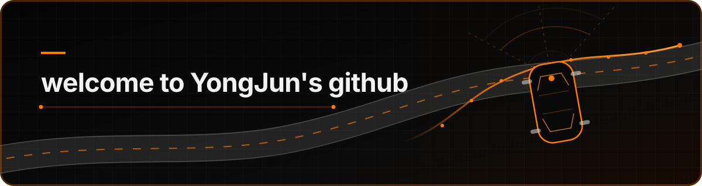

<p align="center">
  
</p>

<p align="center">
  <strong>Second-year undergraduate at Konkuk University</strong><br/>
  Learning by building autonomous vehicles with ROS 2, simulation, and embedded systems.
</p>

<p align="center">
  
  
  
  
  
</p>

## About

I am interested in autonomous-driving software that connects planning algorithms, vehicle simulation, sensors, and embedded hardware. My current work covers behavior and motion planning, vehicle interfaces, RTK GNSS, CAN communication, simulation, and edge AI.

## 2026 Competition Projects

### KAI2026 · KAI Creative Mobility Competition


An in-progress autonomous mobility project integrating ROS 2 Humble, Gazebo Harmonic, perception, behavior decisions, path and speed planning, control, CAN SITL, and STM32 HIL.

`ROS 2` `Gazebo Harmonic` `Perception` `Planning` `Control` `CAN` `STM32`

---

### [HL FMA 2026 · 1/5-Scale Autonomous Vehicle](https://github.com/yunny22/HL_KU)


A safety-oriented ROS 2 driving stack combining dual-antenna RTK GNSS, route tracking, mission management, speed and steering control, and a NUCLEO-H743ZI2 interface.

`RTK GNSS` `Path Tracking` `Safety Supervisor` `ROS 2` `NUCLEO-H743ZI2`

---

### [Kookmin Autonomous Driving Competition · Xycar](https://github.com/juuny0317-cmd/Kookmin2026)


An Xycar project connecting a measured-data-based Ackermann vehicle simulation with camera, LiDAR, and lane-driving software through hardware-compatible ROS 2 interfaces.

`Xycar` `Ackermann Steering` `Camera` `LiDAR` `Lane Driving` `Gazebo`

---

### Embedded Software Contest 2026 · CODRIVE


A distributed driver-assistance framework connecting Jetson-based perception, STM32 audio sensing, and Raspberry Pi sensor fusion and risk assessment through CycloneDDS.

Initial siren-classification baseline: **95.05% precision · 84.74% recall · 89.60% F1** on a 5,000-sample implementation-validation subset.

`Jetson` `Raspberry Pi` `STM32` `CycloneDDS` `Sensor Fusion` `Edge AI`

## Engineering Focus

```text
Sensors  →  Perception  →  Decision & Planning  →  Control  →  Vehicle
                 ↘       Safety Supervisor       ↗
```

- Modular ROS 2 behavior, motion, speed, control, and safety nodes
- Gazebo vehicle simulation calibrated from measured steering and speed data
- RTK GNSS route collection, coordinate conversion, tracking, and smoothing
- CAN and serial communication between Linux computers and embedded controllers
- Reproducible testing and documentation for competition systems

## GitHub Activity

<p align="center">
  
  
</p>

## Productive Hours

My commit-time distribution is updated automatically every day with [productive-box](https://github.com/maxam2017/productive-box).

[View the live productive-hours gist](https://gist.github.com/juuny0317-cmd/51f1f0869c5ea98d17f55e17ecc7d1e5)

<!-- productive-box:start -->
```text
My productive coding hours, updated automatically by productive-box.

🌞 Morning     0 commits  ░░░░░░░░░░░░░░░░░░░░░   0.0%
🌆 Daytime     1 commits  █░░░░░░░░░░░░░░░░░░░░   5.3%
🌃 Evening     0 commits  ░░░░░░░░░░░░░░░░░░░░░   0.0%
🌙 Night      18 commits  ███████████████████▉░  94.7%
```
<!-- productive-box:end -->

<p align="center">
  <sub><span style="color:#ff7a00">Build. Measure. Improve.</span></sub>
</p>
